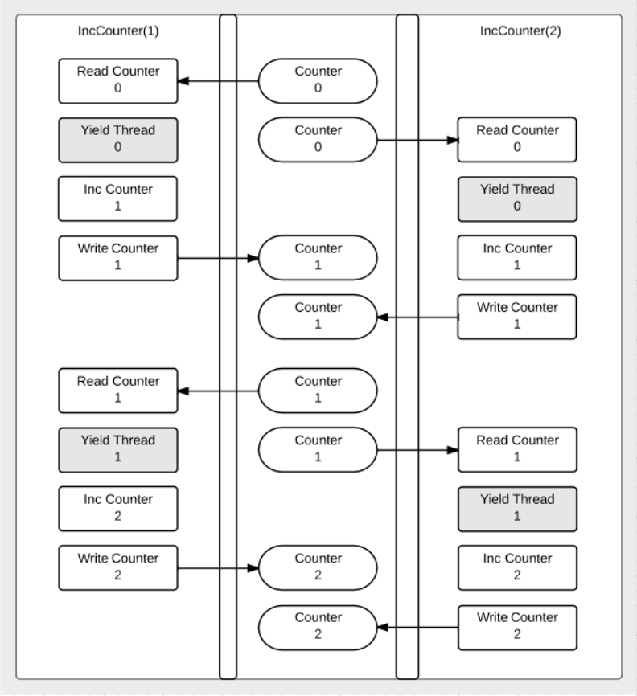

# Document

<!--toc:start-->

- [Document](#document)
  - [Concurrency vs parallelism](#concurrency-vs-parallelism)
  - [WaitGroup](#waitgroup)
  - [Method set revisited](#method-set-revisited)
  - [Documentation](#documentation)
  - [Race condition](#race-condition)
  - [Mutex](#mutex)
  - [Atomic](#atomic)
  <!--toc:end-->

## Concurrency vs parallelism

But when people hear the word concurrency they often think of parallelism, a related but quite distinct concept. In programming, concurrency is composition of independently executing processes, while parallelism is the simultaneous execution of (possibly related) computations. Concurrency is about dealing with lots of things at once. Parallelism is about doing lots of things at once.

## WaitGroup

**`A WaitGroup waits for a collection of goroutines to finish.`** The main goroutine calls Add to set the number of goroutines to wait for. Then each of the goroutines runs and calls Done when finished. At the same time, wait can be used to block until all goroutines have finished. Writing concurrent code is super easy: all we do is **`put "go" in front of a function or method call.`**

- runtime.NumCPU()
- runtime.NumGoroutine()
- sync.WaitGroup
  - func (wg \*WaitGroup) Add(delta int)
  - func (wg \*WaitGroup) Done()
  - func (wg \*WaitGroup) Wait()



## Method set revisited

**`The method set of a type is determines the interfaces that the type implements...`**

| Receivers | Values     |
| --------- | ---------- |
| (t T)     | T and `*T` |
| (t `*T`)  | `*T`       |

Example:

```go
package main

import (
    "fmt"
    "math"
)

type circle struct {
    radius float64
}

type shape interface {
    area() float64
}

func (c *circle) area() float64 {
    return math.Pi * c.radius * c.radius
}

func info(s shape){
    fmt.Printf("Area: %.2f\n", s.area())
}

func main(){
    c := circle{5}
    // info(c)
    fmt.Println(c.area())
}
```

## Documentation

They're called goroutines because the existing terms - threahs, coroutines, processes, and so on - convey inaccurate connotations. A goroutine has a a simple model: it is a function executing concurrently with other goroutines in the same address space.

```go
package main

import (
    "fmt"
)

func doSomething(x int) int {
    return x * 5
}

func main() {
    ch := make(chan int)
    go func() {
        ch <- doSomething(5)
    }()
    fmt.Println("Result:", <-ch)
}
```

## Race condition

Here is a picture of the race condition we are goint to create:


**`Race conditions are not good code. A race condition will give unpredictable results.`**

```go
package main

import (
 "fmt"
 "runtime"
 "sync"
)

func main() {
    fmt.Println("CPUs:", runtime.NumCPU())
    fmt.Println("Goroutines:", runtime.NumGoroutine())

    counter := 0

    const gs = 100
    var wg sync.WaitGroup
    wg.Add(gs)

    for i := 0; i < gs; i++ {
        go func() {
        v := counter
        runtime.Gosched()
        v++
        counter = v
        wg.Done()
        }()
        fmt.Println("Goroutines", runtime.NumGoroutine())
    }

    wg.Wait()
    fmt.Println("Goroutines", runtime.NumGoroutine())
    fmt.Println("count:", counter)
}
```

## Mutex

A "mutex" is a mutual exclusion lock. **`Mutexes allow us to lock our code so that only one goroutines can access that locked chunk of code at a time.`**

```go
package main

import (
 "fmt"
 "runtime"
 "sync"
)

func main() {
    fmt.Println("CPUs:", runtime.NumCPU())
    fmt.Println("Goroutines:", runtime.NumGoroutine())

    counter := 0

    const gs = 100
    var wg sync.WaitGroup
    wg.Add(gs)

    var mu sync.Mutex

    for i := range gs {
        go func() {
        mu.Lock()
        v := counter
        runtime.Gosched()
        v++
        counter = v
        mu.Unlock()
        wg.Done()
        }()
        fmt.Println("Goroutines:", runtime.NumGoroutine())
    }

    wg.Wait()
    fmt.Println("Goroutines:", runtime.NumGoroutine())
    fmt.Println("count:", counter)
}
```

## Atomic

We can **`use package atomic to also prevent a race condition` in our incrementer code.**
